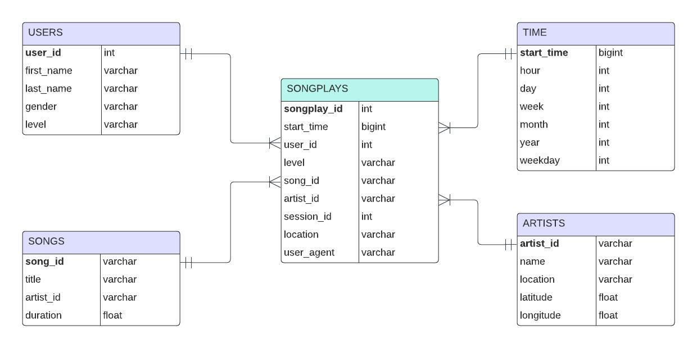

# ETL-python-project
Data engineering Pipeline using Python and PostgresSQL

### Description

In this project we are going to create a new database called Sparkify which represents a music app. This app is collecting data based on user behavior and songs.
The data is divided through different JSON logs of user activity and JSON file with song details. The final scope is to build an ETL pipeline which provides an easier way to analyze this information so the app can get useful insights about their services.

### Song dataset

Here is an example of json file from Songs dataset:

{"num_songs": 1, "artist_id": "ARD7TVE1187B99BFB1", "artist_latitude": null, "artist_longitude": null, "artist_location": "California - LA", "artist_name": "Casual", "song_id": "SOMZWCG12A8C13C480", 
"title": "I Didn't Mean To", "duration": 218.93179, "year": 0}

As we see there are information about songs and artists. These will be extracted into songs tables and artists tables.

### Log dataset

Here is an example of json file from log dataset, each file contains multiple records about users activities. We will populate time table, users table and songplays table.

{"artist":"N.E.R.D. FEATURING MALICE","auth":"Logged In","firstName":"Jayden","gender":"M","itemInSession":0,"lastName":"Fox","length":288.9922,"level":"free","location":"New Orleans-Metairie, LA","method":"PUT","page":"NextSong","registration":1541033612796.0,"sessionId":184,"song":"Am I High (Feat. Malice)","status":200,"ts":1541121934796,"userAgent":"\"Mozilla\/5.0 (Windows NT 6.3; WOW64) AppleWebKit\/537.36 (KHTML, like Gecko) Chrome\/36.0.1985.143 Safari\/537.36\"","userId":"101"}

The best way to work with this information is to create a dataframe to read this data, usa pandas and JSON libraries.

### Database ERD

Dimension tables: users, songs, time, artists
Fact table: songplays

### ETL pipeline steps

**sql_queries.py** will define all the tables structure as well as insert statements for each of them, so begin with this one and get familiar with the structure of the tables described above in the ERD diagram

**create_tables.py** will be built based on sql_queries.py and will contain functions for connecting to the default Postgres database on localhost and create Sparkify database. We will include a function for closing other instances of the database as well, and based on the functions drop_tables, create_tables we can run all the created queries and the database will be up and ready

**etl jupyter notebook** will be the baseline for our pipeline and we care going to use it in combination with **'test' notebook** so we can adapt our existing logic for extracting, transforming and inserting data in the created tables from JSON documents.

**etl.py** is the final part which is build based on the **etl jupyter notebook** which includes all the steps of the extracting, loading and transforming data in our sparkify database

